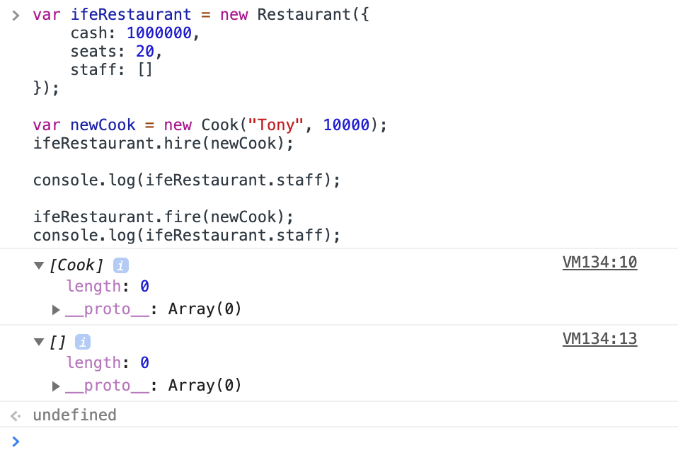
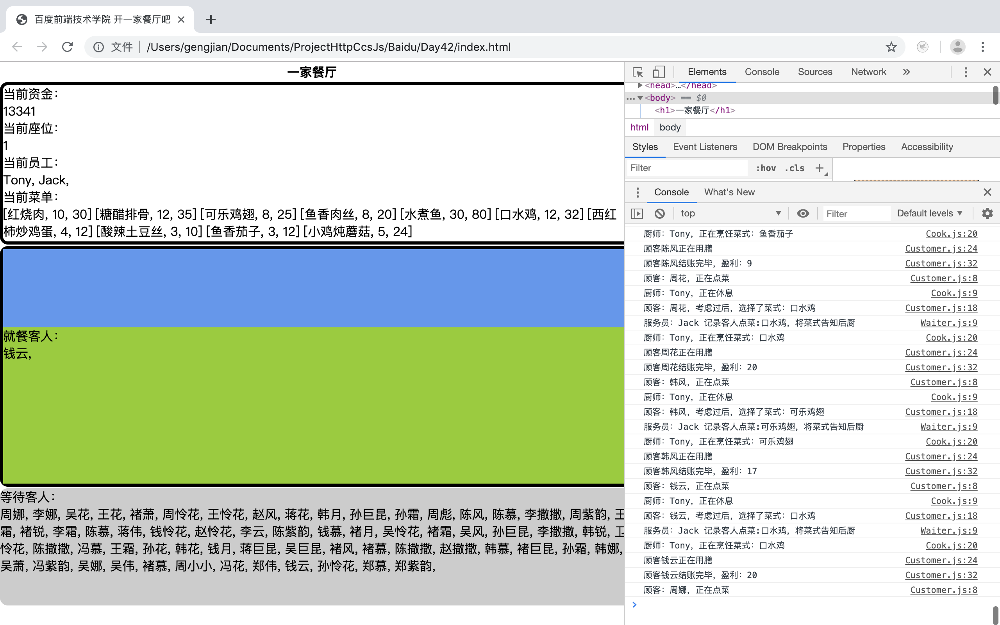

# 百度前端技术学院  
## 第四十二天到第四十三天：开一家餐厅吧（一）
### 课程目标  
通过一个新的系列课程，我们来学习更多的JavaScript知识，比如如何在JavaScript使用面向对象编程，如何在你的设计中应用设计模式.

### 需求
我们现在要开一个餐厅啦，餐厅里面有服务员，有厨师，有顾客。学习面向对象，为餐厅和几个角色创建自己的类吧。  
餐厅可以招聘或者解雇职员，职员越多，就越能够满足更多的顾客需求，从而赚取更多的钱  
餐厅里的容量是有限的，当顾客坐满了，其他顾客需要排队  
服务员的工作有两个职责，一个是负责点菜，另外一个是上菜  
厨师的职责就一个，烹饪食物  
顾客可以做两件事情，一个是点菜，一个是吃  
系列任务的第一个部分，我们先只实现类的编写。并通过大量阅读掌握JavaScript的面向对象编程  

### 设计
餐厅类  
* 属性：金钱，座位数量、职员列表
* 方法：招聘职员，解雇职员
职员类  
* 属性：ID，姓名，工资
* 方法：完成一次工作
服务员类，继承自职员  
* 完成一次工作：如果参数是个数组，则记录客人点菜，如果参数不是数组则是上菜行为
厨师类，继承自职员  
* 完成一次工作：烹饪出菜品
顾客类  
* 方法：点菜，吃
菜品类  
* 属性：名字、烹饪成本、价格

## 第四十四天到第四十六天：开一家餐厅吧（二）
### 课程目标  
通过完善餐厅的功能，来学习JavaScript面向对象编程，及一些基本的设计模式

### 需求
我们上个任务已经创造了各个角色，现在，我们希望让各个角色动起来。  
我们假设只有一个厨师，一个服务员，一个座位。而且餐厅老板是个偏执狂，他喜欢简单，他需要保证餐厅永远只有一个厨师，一个服务员和一个座位。  
整个餐厅的运作流程是这样的，顾客入座，服务员招待顾客点菜，点完菜后告诉厨师，厨师做好菜后服务员上菜，顾客用餐，然后换下一个顾客  
你需要设计一个菜单，然后设计一个顾客随机点菜的方法  

### 设计
首先，我们需要重新来设计我们的厨师、服务员的类，阅读上面的文章，按照单例的方式来进行设计  
第二，我们需要解决对象与对象之间的交流问题，在这个简单的餐厅中，当顾客入座时，服务员使用服务点菜方法，调用顾客的点菜方法得到顾客点的菜，然后服务员去告诉厨师需要做什么菜，厨师开始做菜，做完菜以后告诉服务员去上菜，上菜完成后，顾客开始用餐，吃完后，下一个顾客进来。在这个流程中，你可以给每个类都创建对应的交流沟通相关的方法来实现。  
第三，实现一个顾客队列  
第四，实现一个菜单，包括菜名、价格，然后实现一个点菜的方法，我们默认顾客每次只点一个菜  

## 第四十七天到第四十九天：开一家餐厅吧（三）
### 课程目标  
通过今天的练习，来继续深入练习，如何通过编程中的抽象设计、封装来解决实际问题  
尝试把我们提供的学习资料中的内容，运用到任务编码中  

### 需求
在真实世界中，点菜、烹饪、用餐都是需要时间的，我们给我们的餐厅加上时间的因素。  
我们假设每一个时间单位是 1 秒（可配置）。  
* 点菜需要 3 个时间单位  
* 做菜的时间不一定，每个菜需要的时间不一样，所以需要在菜单的数据中添加一个字段，描述这个菜需要用的时间，比如在 1-10 个时间单位这个区间
* 用餐时间，每个菜的用餐时间为 3 个时间单位，如果顾客点了 n 个菜，则需要 3 * n 个时间单位
* 我们再做一些小调整，顾客点菜不一定只点一个了，可以是多个菜

### 设计
我们先做一些小的调整：  
* 菜单数据增加烹饪这个菜需要的时间的字段
* 顾客点菜的函数变成随机点多个菜
接下来，对每一个行为加上时间的因素，我们推荐使用Promise的方式，然后整个流程可以如下：  
* 顾客入座，顾客开始用 3 个时间单位想要吃什么菜，时间到后 then，告诉服务员
* 服务员告诉厨师，假设他们之间交流是不需要时间的
* 厨师开始烹饪，每烹饪好一个菜 then 叫服务员上菜，同时开始做下一个菜，先假设上菜是不需要时间的
* 服务员上菜后，顾客开始用餐，点的全部菜都吃完后 then 付款，同时下一个顾客入座

### 需求
上个任务中，我们让大家通过Console.log的方式来看餐厅运营情况，这次我们需要把做一个界面来展现餐厅运营情况。  
另外为了逼真，很多行为都需要耗时了，具体需求如下：    
* 需要一个数字来实时显示餐厅的现金数量
* 用一个厨师的图片，在图片附近显示厨师的状态：空闲 或者是 在做 XXX 菜，还差多少时间做完，并在旁边显示待做的菜列表
* 用一个服务员的图片，展示服务员的状态，顾客点菜的时候，服务员在顾客这边，厨师做菜的时候，服务员在厨师那边，上菜的时候，又到了厨师那边，服务员的移动是需要时间的，在厨师和顾客之间的单程移动需要 0.5 个时间单位，这意味着：
* 服务员给顾客点完菜后，把点的菜送到厨师那里，需要 0.5 个时间单位
* 厨师烹饪好菜后，服务员从厨师这里上菜到顾客那里，需要 0.5 个时间单位，然后再回到厨师那里又需要 0.5 个时间单位
* 如果你有余力，可以做成一个动画，没有时间的话，就在时间单位到后直接改变状态（文字显示或位置均可）就行
* 用一个顾客的图片，展示顾客的状态，点菜中（并显示还差多少时间点好），点好后，显示顾客点的菜的List及每个菜的状态（还未上，正在吃（还差多久吃完），已吃完）
* 有一个排队的顾客 List 显示在页面中。
需要注意：
* 厨师做好一个菜以后，叫服务员后，就可以去做下一个菜了，不需要等服务员是否开始上菜
* 注意优化服务员的位置，尽量使得服务员在空闲的时候，去往下一个任务的起始点。比如：
* 上菜后，如果顾客点的菜没上完，那服务员应该回到厨师那里准备上下一个菜
* 上菜后，如果顾客点的菜上完了，则服务员应该留在顾客旁边准备收银及服务下一个顾客

### 环境
* 硬件环境  
MacBook Pro
* 软件环境  
MacOS (10.14.2)  
VS Code (version 1.36)  
Google Chrome (75.0.3770.100)  
Firefox (67.0.4)  

### 作品展示
[展示链接](https://gengjian1203.github.io/BaiDuIFE_Day42/)  

### 相关链接
[百度前端技术学院-第四十二天到第四十三天：开一家餐厅吧（一）](http://ife.baidu.com/course/detail/id/58)  
[百度前端技术学院-第四十四天到第四十六天：开一家餐厅吧（二）](http://ife.baidu.com/course/detail/id/59)  
[百度前端技术学院-第四十七天到第四十九天：开一家餐厅吧（三）](http://ife.baidu.com/course/detail/id/60)  

